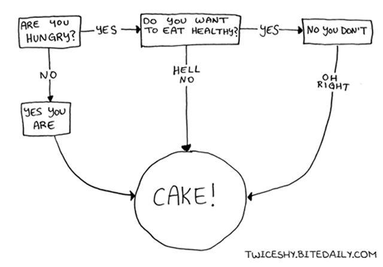

## Topics

Below is a summary of the topics covered in this lecture:

- Control Structures
	- Branching
	- Looping
- Functions
- Environment and Scope
- Special values
- R Coding Standard from RNS

## Control Structures

Most programs have two general flow control features: **iteration** and **alternation**. Iteration is done via loops, alternation via *if-then-else* branches.

### Looping

Here is a basic for-loop that assign values to a preallocated vector in sequence. Note that the pair of braces `{ }` is used to open and close **a block of code**.

```{r, results=F}
# Create an empty vector with a specific length
vec <- vector(mode = 'numeric', length = 10)
print(vec)

# Loop through each position and assign a value accordingly
for (i in seq_len(10)) {
	vec[i] <- i * 2
}

# The above for statement is equivalent to the following
for (i in 1:length(vec)) {
	vec[i] <- i * 2
}

# Examine vector values after the assignment
print(vec)

# Q: Magic number is usually not a good idea in programming.
# What would you replace the magic number 10 in the first
# for-loop statement with?
#
```

Here is a basic while-loop example that achieves the same task.

```{r, results=F}
# Create an empty vector with the length
vec <- vector(mode = 'numeric', length = 10)

# Specify where we start counting
i <- 1

while (i < length(vec)) {
	vec[i] <- i * 2
	
	# Try to comment the following line, assign 1 to i
	# (line 70 in the script), and then run the loop.
	# See what would happen.
	#
	i <- i + 1
}

print(vec)

# Q: Do you spot a difference between this and the
# previous results? We just had our FIRST bug!
# Could you fix it?
#
```

### Branching

```{r, out.width = "300px", fig.align="center", echo=F}

```

Branching is an important mechanism in computer programs, and in daily lives, of course. A branch allows you to execute some code if certain conditions are met, and do something else in other cases. 
Below are some examples for branching.

```{r, results=F}
x <- 5
y <- 10

# Use the relational operator as a condition
if (x == y) {
	print("x and y are the same.")
} else if (x < y) {
	print('x is less than y.')
} else {
	print('y is a mysterious number.')
}

x <- 'b'

# Use the return from a function as a condition
if (is.element(x, letters)) {
	print(paste(x, 'is a letter.'))
} else {
	print(paste(x, 'is NOT a letter.'))
}
```

## Functions

We now have already used many functions that come with R. A function is a block of **organized**, **reusable** code that is used to perform a **single**, **related** action. Some other words which might refer to functions inlcude *methods*, *sub-routines*, and *procedures*. A function is usually composed of 1) a function name, 2) a parameter list, 3) the function body, and 4) a return type.

R already provides thousands of functions. If you already know the name of the function, you can use the question mark plus the function name to open up the help page, or the documentation, for the function, for example, `?nrow`.

### Default Arguments

In the documentation of `nrow`, the argument `x` does not have a default value attached. So the following code is bound to fail.

```{r, error=T}
# No arguments are provided
nrow()

# Q: Try to look at the documentation for the function matrix().
# Will the code fail if we do not pass any arguments?
#
# Q: How about the function as.vector()?
#
```

### Writing Functions

But sometimes, you will still need to write your own functions for a specific purpose. Maybe you are not able to find a function to do exactly what you want to do, or you simply want to **modulize** a portion of your code.

The syntax for function definition is:

```
function_name <- function(arg_1, arg_2, ...) {
   Function body
   return
}
```

Here is an example of defining a function which takes the length of the output vector and calculates the Fibonacci sequence.

A Fibonacci sequence is the intteger sequence of `0, 1, 1, 2, 3, 5, 8, ...`. The first two terms are 0 and 1. All other terms are obtained by adding the preceding two terms. This means to say the nth term is the sum of (n-1)th and (n-2)th term. 

```{r}
# Define 
fibo.seq <- function(len) {
	fibo <- numeric(length = len)
	
	fibo[1] <- 0
	fibo[2] <- 1
	
	for (i in 3:len) {
		fibo[i] <- fibo[i-1] + fibo[i-2]
	}
	
	return(fibo)
}

# Change the function argument and see how the 
# result would change.
# 
print(fibo.seq(10))

# Q: Do you find this piece of code easy to understand?
# What would you add to this piece of code?
# 
# Q: Do you think this function is reliable?
# 
```

In this case, there is already a function for Fibonacci Sequence calculation. We can, instead of implementing our own, use the package.

```{r, results=F}
# If package is not found, you need to install it first.
# install.packages('numbers')
# 
# Load the library so R can find the function
library(numbers)

# Call the function from the package by name. R will
# automatically find the package which the function belongs to.
#
fibonacci(10)

# Q: Do results look the same? How would you find out the cause?
# Q: What are the pros and cons when using a third-party package?
# Q: How would you contribute to the R community?
# 
```

## Environment and Scope

```{r}
# I'm going to define a bunch of symbols for you to play with.
df <- data.frame(id = 1:10, value = runif(10))
l <- list(a = 'A', b = 1:5, c = NA)
v <- 1:10
func.1 <- fibonacci
func.2 <- mean
```

The panel (by default) at the top right of the RStudio window shows all the symbols defined in the **global environemnt**. Some of the symbols will respond to clicks. Try them out.

## Special Values

R language supports several null-able values and it is relatively important to understand how these values behave, when making data pre-processing and data munging. R supports:

- `NA`: An object and is returned when an expression or function results in an undefined value. In R language, NULL (capital letters) is a reserved word and can also be the product of importing data with unknown data type.
- `Inf` and `-Inf`: They stands for infinity (or negative infinity) and is a result of storing  either a large number or a product that is a result of division by zero. Inf is a reserved word and is – in most cases – product of computations in R language and therefore very rarely a product of data import. Infinite also tells you that the value is not missing and a number!
- NaN: Not A Number. It is a logical vector of a length 1 and applies to numerical values, as well as real and imaginary parts of complex values, but not to values of integer vector. NaN is a reserved word.
- NULL: It is an object and is returned when an expression or function results in an undefined value. In R language, NULL (capital letters) is a reserved word and can also be the product of importing data with unknown data type.
	
Contents referenced from [R null values: NULL, NA, NaN, Inf](https://www.r-bloggers.com/r-null-values-null-na-nan-inf/)

## R Coding Standard

Please go through [Google's R Style Guide](https://google.github.io/styleguide/Rguide.html).

Personally, I often rely on the auto-formatting functionality from RStudio. You can find it at `Code -> Reformat Code`. But it is only for R scripts.
