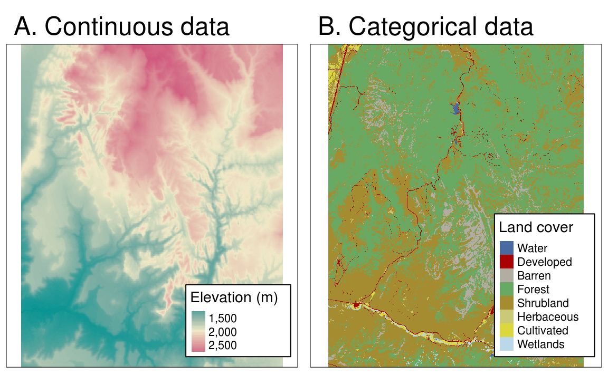
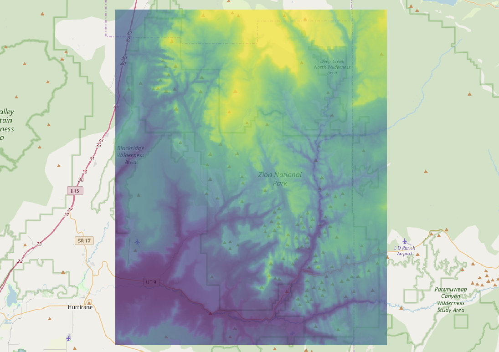
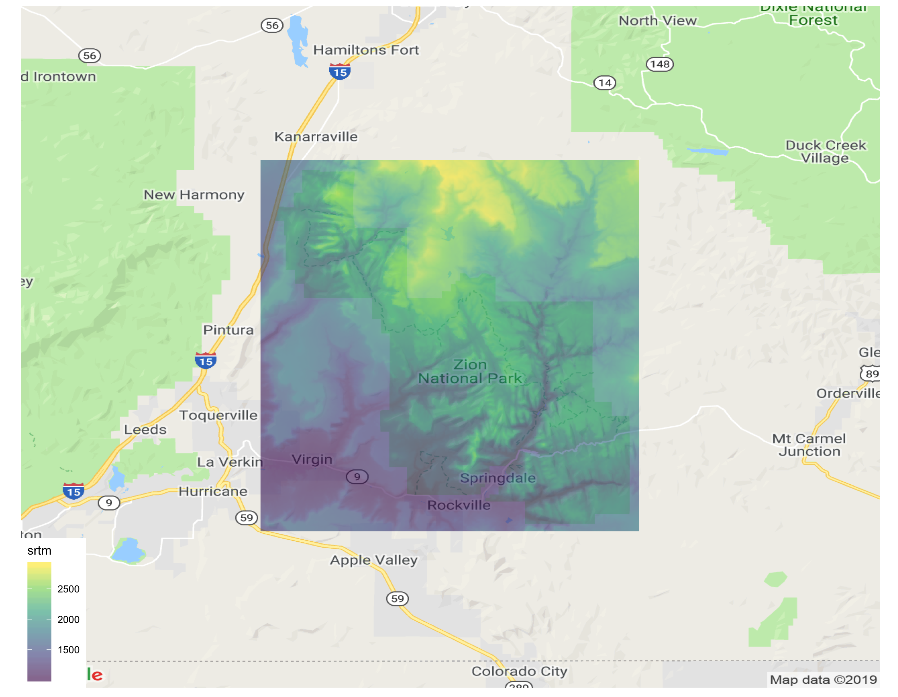

```{r env-preparation, include = F}
library(maps)
library(ggmap)
library(raster)
library(ggplot2)
library(ggthemes)
library(spDataLarge)

knitr::opts_chunk$set(fig.align = "center")
```

## Topics

Below is a summary of the topics covered in this lecture:

- Raster Data
- File Reading and Writing
- Coordinate Reference System
- Spatial Data Visualization
	- Static
	- Animated
	- Interactive

## Raster Data

### Basic Information

```{r, out.width = "400px", echo=F}

```

Raster maps usually represent continuous phenomena such as elevation, temperature, population density or spectral data. Of course, we can represent discrete features such as soil or land-cover classes also with the help of a raster data model.

The geographic raster data model usually consists of **a raster header** and **a matrix** (with rows and columns) representing equally spaced cells (often also called pixels).

The raster header defines the coordinate reference system, the extent and the origin. The header defines the extent via the number of columns, the number of rows and the cell size resolution. Hence, starting from the origin, we can easily access and modify each single cell by either using the ID, or the index, of a cell or by explicitly specifying the rows and columns.

This matrix representation avoids storing explicitly the coordinates for the four corner points of each cell corner as would be the case for rectangular vector polygons. In fact it only stores one coordinate, namely the origin. This makes raster processing much more efficient and faster than vector data processing.

**Remeber**: for the `raster` package, although the content in a raster object is organized in a matrix, it counts from the **upper left** of the matrix and fills cells **row-wise**.

```{r}
# Create a raster with distinctive values
rast1 <- raster(nrows = 2, ncols = 3, vals = 1:6)

# Query the coordinates of cells
coords <- coordinates(rast1)

# Plot the raster we just created
plot(rast1)

# Overplot the cell number
text(coords, labels = 1:6)
```

### The `raster` class

Rasters can be created from scratch using the `raster()` function. The above code illustrates how to create a `RasterLayer` object. The resulting raster consists of 36 cells (6 columns and 6 rows specified by nrows and ncols) centered around the Prime Meridian and the Equator (see xmn, xmx, ymn and ymx parameters). The CRS is the default of raster objects: WGS84. This means the unit of the resolution is in degrees which we set to 0.5 (res). Values (vals) are assigned to each cell: 1 to cell 1, 2 to cell 2, and so on.

```{r}
rast2 <- raster(
  nrows = 6, ncols = 6, res = 0.5, 
  xmn = -1.5, xmx = 1.5, ymn = -1.5, ymx = 1.5,
  vals = 1:36)

# Q: What is the origin of the raster we just created?
# Is that what you expected?
#

# To examine a raster
# Q: Can you guess some functions that would work on
# rasters to get their attributes?
# 
# You can find a complete list of functions to use 
# in the documentation section XI. Getting and setting
# Raster* dimensions
# 
# ?'raster-package'
```

But most of the time, we create a `raster` from a file. We are going to read data from the package [`spDataLarge`](https://rdrr.io/github/Nowosad/spDataLarge/man/). The data set *srtm* contains the elevation raster data from SRTM of the Zion National Park area

```{r}
# Get the file path to the input TIF image
input.file <- system.file('raster/srtm.tif', package = 'spDataLarge')

# Create raster from a TIF file
rast.srtm <- raster(input.file)

# Q: Examine the attributes of this input raster.
```

The following code writes a raster to your local file disk.

```{r, eval=FALSE}
# Specify the location of the output file
output.file <- 'srtm.tif'

# The TIF image will be created
writeRaster(ras.srtm, format = 'GTiff',
            filename = output.file)
```

You can then open the TIF image in other GIS software for further analysis and visualization if you prefer. For example, I use [QGIS](https://www.qgis.org/en/site/) to generate the following figure which overlays the TIF image on top of [Open Street Map](https://www.openstreetmap.org/).

```{r, out.width = "300px", echo=F}

```

## Visualization

### Rasters

The following code shows how to generate the same overlay map within R.

```{r, message = F, out.width = "300px", fig.align="center"}
# Convert raster to a flat table
df.rast.srtm <- as.data.frame(
  rast.srtm, xy = T)

# Generate plot using the default map
bbox <- bbox(rast.srtm)
map <- get_map(location = bbox)

# Generate plot using Google map
# register_google(key = '<Your API Key>')
# map <- get_map(location = rowMeans(bbox),
#                maptype = 'roadma')

p <- ggmap(map) +
  geom_raster(
    data = df.rast.srtm,
    mapping = aes(
      x = x, y = y, fill = srtm)) +
  scale_fill_viridis_c(alpha = 0.6) +
  coord_equal() +
  theme_map()

# ggsave(p, filename = '../figures/raster-google.png', width = 9)
print(p)
```

If you set up the Google API key, you can create the following figure.

```{r, out.width = "300px", echo=F}

```

Use `ggmap::register_google()` to check the instructions for setting up the API key.

### Rasters and Vectors

