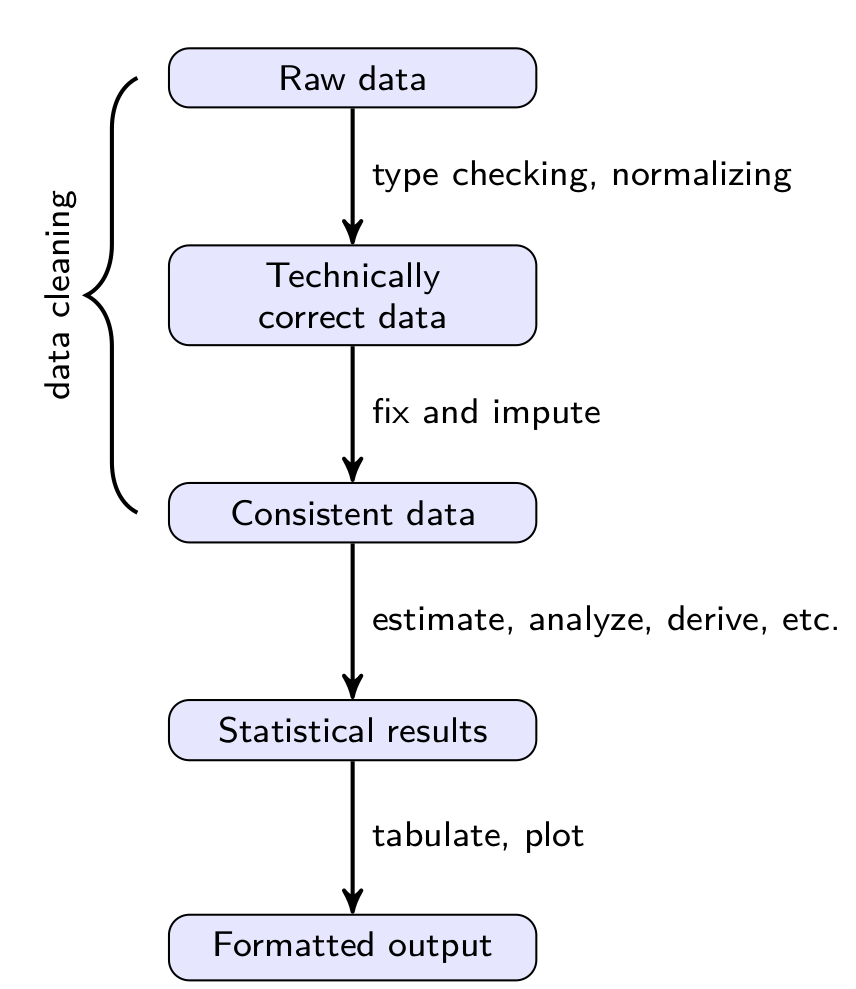

```{r env-preparation, include = F}
# Load some libraries to prepare the environment
library(ggplot2)
library(reshape2)
library(knitr)
library(cowplot)

# Set global options
opts_chunk$set(fig.height = 4)
```

## Topics

Below is a summary of the topics covered in this lecture:

- Data Cleaning
- Pivot and Flat Tables
- Basic Visualization
- [R Coding Standard from Google](https://google.github.io/styleguide/Rguide.html)

## Data Cleaning

Most statistical theory focuses on data modeling, prediction and statistical inference while it is usually assumed that data are in the correct state for data analysis. Typically, a data analyst spends a significant portion of the time cleaning the data set prior to the actual analysis.

```{r, out.width = "200px", fig.align="center", echo=F}

```

The above figure, referenced from Edwin deJonge and Mark van der Loo, *An introduction to data cleaning with R*, shows an overview of a typical data analysis project. As the data passes through each step, the **value** of data increases.

During today's class, we are going to focus on the component, **data cleaning**.

The data file we are going to work with today is the world total population data set from the World Bank. It can be accessed from [https://data.worldbank.org/indicator/SP.POP.TOTL?view=map](https://data.worldbank.org/indicator/SP.POP.TOTL?view=map). The specific data file used in this course was last updated on 2019-07-10 in the repository and is only a subset of the original file. Modifications have been made to the original records to better illustrate the each stage during data cleaning.

## Raw Data Examination

Let's read the data into R first.

```{r, results = F}
# Read a table from the CSV file
dat <- read.table(
	file = 'assets/world-population.csv',
	sep = ',', quote = "\"", header = T,
	stringsAsFactors = F)

# Q: Try with different arguments of the function. What 
# are the differences in the results?
# 
# Q: How would you examine the data we have just loaded?
# 
```

## Technically Correct Data

Checking the technical correctness of a data set generally requires background knowledge on a specific field and on the specific data set. Can you spot some potential mistakes from the data set? Before reading through the following code, please think about what are the functions that can aid you to check the correctness.

Again, we are looking for **suspicious records** that might potentially be mistaken. We won't know for sure whether they are definitely right or wrong, but we have a sense of the quality of the data set we are working on.

```{r, results = F}
# Some hints
str(dat)
View(dat)
summary(dat)
```

**Stop** if you have not tried to find suspicious places by yourself.

```{r, results = F}
# The biggest mistake in the data set is the naming of countries.
# Luckily, we have the associated country code which we hope to
# be correct. I have prepared the look-up table.
#
country.codes <- read.table(
	'assets/country-codes.csv', sep = ',',
	header = T, stringsAsFactors = F)

# For each country code in the population table, we check its
# correct country name in the lookup table and modify the 
# original name in the population table.
#
for (i.row in seq_len(nrow(dat))) {
	
	# Find the matching row in the lookup table
	i.row.match <- which(
		country.codes$Country.Code ==
			dat$Country.Code[i.row])
	
	# Extract the correct name for the code
	real.name <- country.codes$TableName[i.row.match]
	
	# Print what will be changed
	cat('Change', dat$Country.Name[i.row], 'to', real.name, '\n')
	
	# Assign back the correct name
	dat$Country.Name[i.row] <- real.name
}
```

## Consistent Data

Consistent data are technically correct data that are fit for statistical analysis. This is the last step of quality control before the data set are sent over to statistical modeling and analysis. **Data consistency** can be decomposed into:

- **In-record** consistency: No contradictory information is sotred in a single record;
- **Cross-record** consistency: Statistical summaries of different variables do not conflict with each other.

The process towards consitent data always involves the following three steps:

1. Detection of an inconsistency. That is, one establishes which constraints are violated. For example, an age variable is constrained to non-negative values.
2. Selection of the field or fields causing the inconsistency. This is trivial in the case of a univariate demand as in the previous step, but may be more cumbersome when cross-variable relations are expected to hold. For example the marital status of a child must be unmarried . In the case of a violation it is not immediately clear whether age, marital status or both are wrong.
3. Correction of the fields that are deemed erroneous by the selection method.

Try to spot an inconsistent data column **before** you read on to the following chunk.

```{r, results = F}
# Delete the inconsistent variable
dat$X <- NULL

# Q: What are some other ways to remove a column from
# a data frame?
# 
# Q: What is particularly bad about the following line?
# dat <- dat[-64]

# There is redundancy in the data table
col.to.remove <- which(colnames(dat) == 'Indicator.Code')
col.to.remove <- c(col.to.remove, which(colnames(dat) == 'Country.Code'))
col.to.remove <- c(col.to.remove, which(colnames(dat) == 'Indicator.Name'))
dat <- dat[-col.to.remove]
```

Now we can go ahead and check the cosistency of records. This is when figures become very important.

```{r}
# Visualization with base plot methods
par(mar = c(5, 4, 4, 2))
barplot(dat$X2018[1:10], names.arg = dat$Country.Name[1:10], las = 2)

# Yes! You can run two commands on the same line
# as long as they are separated by a semicolon.
# 
box(); grid()
title(ylab = 'Population', line = 0)

# Q: The above figure looks messed up. Try to adjust the
# arguments for functions par and title to make them in palce.
# 
# *** STOP here if you have not done the adjustment. ***
# 
# The configurations work for me are as follow:
# 
# par(mar = c(8, 7, 1, 1))
# title(ylab = 'Population', line = 4.5)
# 

# Visualization with ggplot2
ggplot(data = dat) + theme_bw() +
	geom_bar(mapping = aes(x = Country.Name, y = X2018), stat = 'identity') +
	theme(axis.text.x = element_text(angle = 90, hjust = 1, vjust = 0.5)) +
	labs(x = '', y = 'Population')
```

So the above figures do not show anything that immediately catches our attention. Does that mean we are finished with data preprocessing? Can we see the trend of population for different countries just to double-check?

Unfortunately, this particular data table is not supported by `ggplot2`. But why?

### Pivot and Flat Tables

For typical data entry and storage, data usually appear in **flat** tables. **Flat** tables are flexible and easy to manipulate with, but they are generally hard to interpret and to get summarized information from. Here is when the **pivot** tables come into play. A pivot table can help quickly summarize the data and highlight the desired information.

Some notable differences between flat and pivot tables are listed:

- Different purposes: Flat tables are designed to store the original data entries for reusability and analysis; pivot tables are designed to show summarized information.
- Different shapes: Flat tables consist of only columns and rows, or in the case of R, variables as columns and observations as rows; pivot tables consist of rows, columns, and data fields. The additional data field is usually an aggregation of a certain group of observations.

**Question**: Is the data we have just loaded a flat table or a pivot table?

```{r}
# Unpivot the table for further analysis
dat.flat <- melt(dat, id.vars = 'Country.Name')

# Change from characters to numbers
dat.flat$variable <- as.numeric(substr(
	x = dat.flat$variable,
	start = 2, stop = 5))

# Change the column names
colnames(dat.flat) <- c('Country', 'Year', "Population")

# Generate a figure for population trend for all countries
ggplot(data = dat.flat) +
	geom_line(mapping = aes(x = Year, y = Population, color = Country)) +
	theme(legend.position = 'top')
```

The figure cannot be correct! There must be some mistakes in some of the entries. Let's look at the histogram of our data.

```{r}
hist(dat.flat$Population, main = 'Population', xlab = '')
```

This histogram looks very skewed and why would we ever have negative values? We need to take care of them.

```{r}
# Where are the negative values?
negative.rows <- which(dat.flat$Population <= 0)

# Where are the values that are suspiciously large?
threshold <- 1.4e+9
large.rows <- which(dat.flat$Population > threshold)

# Change those records to NA
dat.flat$Population[c(large.rows, negative.rows)] <- NA

# Check our histogram again
hist(dat.flat$Population, main = 'Population', xlab = '')
```

Now we can go back and check the trend for population with `ggplot2` again.

```{r}
p1 <- ggplot(data = subset(dat.flat, Country != 'China')) +
	geom_line(mapping = aes(x = Year, y = Population, color = Country)) +
	theme(legend.position = 'top')

p2 <- ggplot(data = subset(dat.flat, Country == 'China')) +
	geom_line(mapping = aes(x = Year, y = Population)) +
	labs(subtitle = 'Population for China')

plot_grid(p1, p2, ncol = 1, rel_heights = c(1.5, 1))
```

We still see some problems here. Some countries have records that are significantly smaller than adjacent years which can be suspicious. Without any background information, a conservative solution is to assign them as NA.

```{r}
# In-class exercise: Write the code that does the following task.
# 
# For each country
#   Get the population for this country for year 1960
#   Assign NA to records that are lower than the population of 1960
# 
# Generate the population plot similar to what we have generated
```